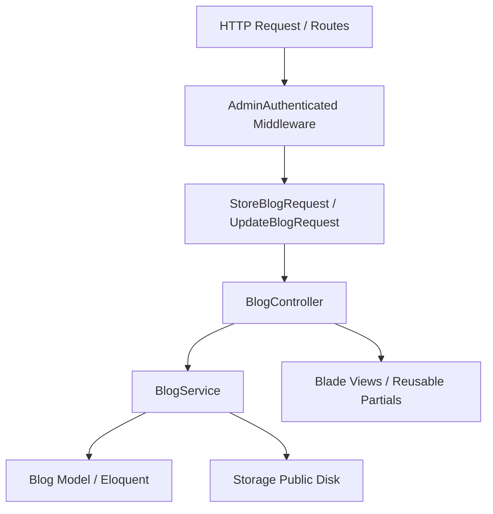

# Blog Module Architecture & Maintenance Guide (`BLOG_MODULE.md`)

This document covers the technical architecture, components, database schema, security, and maintenance workflows for the TaxLegal Blog Admin CMS Module.

---

## 1. Module Architecture

The Blog module follows a clean **Controller-Service-Repository/Model pattern** tailored for maintainability and minimal boilerplate (`ponytail` design philosophy):



- **Separation of Concerns**: `BlogController` handles HTTP requests, input validation delegates, and response rendering. All business logic, querying, slug generation, and file operations are encapsulated in `BlogService`.
- **Single Source of Truth**: Shared validation rules reside in the `BlogValidationRules` trait; global UI helpers (such as search highlighting and clipboard utilities) reside in `AppServiceProvider` and `admin.layout`.

---

## 2. Controllers & Routes

All routes are registered inside `routes/web.php` under the `admin.auth` middleware group (`App\Http\Middleware\AdminAuthenticated`).

### Registered Routes

| HTTP Method | Route Path | Controller Method | Route Name | Purpose |
| :--- | :--- | :--- | :--- | :--- |
| `GET` | `/admin/blogs` | `BlogController@index` | `admin.blogs.index` | Paginated listing of active blog posts with filtering & stats |
| `GET` | `/admin/blogs/trash` | `BlogController@trash` | `admin.blogs.trash` | Paginated listing of soft-deleted blog posts |
| `GET` | `/admin/blogs/create` | `BlogController@create` | `admin.blogs.create` | Render form to create a new blog post |
| `POST` | `/admin/blogs` | `BlogController@store` | `admin.blogs.store` | Validate input and store new blog post (`StoreBlogRequest`) |
| `GET` | `/admin/blogs/{blog}/preview` | `BlogController@preview` | `admin.blogs.preview` | Read-only admin preview of post & SEO metadata |
| `GET` | `/admin/blogs/{blog}/edit` | `BlogController@edit` | `admin.blogs.edit` | Render form to edit existing blog post |
| `PUT/PATCH` | `/admin/blogs/{blog}` | `BlogController@update` | `admin.blogs.update` | Validate input and update blog post (`UpdateBlogRequest`) |
| `PATCH` | `/admin/blogs/{blog}/status` | `BlogController@updateStatus`| `admin.blogs.updateStatus` | Quick toggle between `draft` and `published` status |
| `DELETE` | `/admin/blogs/{blog}` | `BlogController@destroy` | `admin.blogs.destroy` | Soft-delete active blog post |
| `POST` | `/admin/blogs/{id}/restore` | `BlogController@restore` | `admin.blogs.restore` | Restore soft-deleted blog post to active state |
| `DELETE` | `/admin/blogs/{id}/force-delete` | `BlogController@forceDelete`| `admin.blogs.forceDelete` | Permanently remove post from database and delete storage image |

---

## 3. BlogService Methods & Behavior

`App\Services\BlogService` is the core domain service:

- `getPaginated(string|array|null $search, ?string $status, int $perPage)`: Applies filters (`search`, `status`, `created_from/to`, `published_from/to`), sorting (`newest`, `oldest`, `title_asc/desc`, `published_at`, `updated_at`), and returns paginated active blogs.
- `getTrashedPaginated(string|array|null $search, ?string $status, int $perPage)`: Same filtering and sorting applied to `Blog::onlyTrashed()`.
- `getStats()`: Executes a **single aggregation database query** over `Blog::withTrashed()` to calculate `total`, `published`, `draft`, and `trashed` counts.
- `find(int $id)`: Retrieves active blog by ID or throws `ModelNotFoundException`.
- `create(array $data)`: Generates unique slug if omitted, uploads image (`Storage::disk('public')`), sets `created_by`/`updated_by` (`Auth::id()`), sets `published_at` if status is `published`, and stores the record.
- `update(Blog $blog, array $data)`: Preserves existing slug if empty, deletes old image and uploads new one if provided, sets `updated_by`, updates `published_at` dynamically if status changes, and updates the record.
- `updateStatus(Blog $blog, string $status)`: Proxy around `update()` to safely change status.
- `delete(Blog $blog)`: Soft-deletes the blog post (retaining stored files for possible restoration).
- `restore(int $id)`: Restores soft-deleted blog post.
- `forceDelete(int $id)`: Permanently deletes the blog and removes associated image file from disk (`Storage::disk('public')->delete($blog->image)`).
- `generateUniqueSlug(string $title, ?int $ignoreId)`: Generates URL-safe slug (`Str::slug()`) and appends incremental counter (`-1`, `-2`) on collisions.

---

## 4. Validation Rules

Validation rules are shared via `App\Http\Requests\Concerns\BlogValidationRules` across `StoreBlogRequest` and `UpdateBlogRequest`:

| Field | Rules | Description |
| :--- | :--- | :--- |
| `title` | `required, string, max:255` | Primary title of the post |
| `slug` | `nullable, string, max:255, unique:blogs,slug` | Auto-generated from title if omitted; unique constraint ignores current ID on update |
| `excerpt` | `nullable, string, max:500` | Brief summary shown on listings and fallback for SEO description |
| `content` | `required, string` | Rich text HTML payload from CKEditor |
| `image` | `nullable, image, mimes:jpeg,jpg,png,webp, max:2048` | Max 2MB image; validated via image signature inspection |
| `status` | `required, in:draft,published` | Post publishing lifecycle state |
| `published_at` | `nullable, date` | Custom scheduled or historic publishing timestamp |
| `seo_title` | `nullable, string, max:255` | Search engine meta title |
| `seo_description` | `nullable, string` | Search engine meta description |
| `seo_keywords` | `nullable, string, max:255` | Comma-separated search engine keywords |

---

## 5. Database Schema & Indexes

Schema definition from `create_blogs_table` migration:

```sql
CREATE TABLE `blogs` (
    `id` BIGINT UNSIGNED NOT NULL AUTO_INCREMENT PRIMARY KEY,
    `created_by` BIGINT UNSIGNED NULL, -- FK -> admins.id ON DELETE SET NULL
    `updated_by` BIGINT UNSIGNED NULL, -- FK -> admins.id ON DELETE SET NULL
    `title` VARCHAR(255) NOT NULL,
    `slug` VARCHAR(255) NOT NULL UNIQUE,
    `excerpt` VARCHAR(500) NULL,
    `content` LONGTEXT NOT NULL,
    `image` VARCHAR(255) NULL,
    `status` ENUM('draft', 'published') NOT NULL DEFAULT 'draft',
    `published_at` TIMESTAMP NULL,
    `seo_title` VARCHAR(255) NULL,
    `seo_description` TEXT NULL,
    `seo_keywords` VARCHAR(255) NULL,
    `created_at` TIMESTAMP NULL,
    `updated_at` TIMESTAMP NULL,
    `deleted_at` TIMESTAMP NULL -- SoftDeletes
);
```

### Performance Indexes
- `idx_status`: `INDEX(status)` — Accelerates status filtering.
- `idx_published_at`: `INDEX(published_at)` — Accelerates sorting by publish date.
- `idx_status_published_at`: `INDEX(status, published_at)` — Composite index optimizing public queries (`WHERE status = 'published' ORDER BY published_at DESC`).

---

## 6. UI Views & Reusable Components

All UI views reside in `resources/views/admin/blogs/`:

- `index.blade.php`: Main dashboard listing showing aggregate statistics (`$stats`), filter bar, quick status toggles, and search term highlighting.
- `trash.blade.php`: Soft-deleted recycle bin listing with restore and permanent delete actions.
- `create.blade.php` / `edit.blade.php`: Wrappers around `_form.blade.php` with appropriate route and method configuration.
- `_form.blade.php`: Reusable form partial containing CKEditor 5 integration, real-time character counters (`excerpt`, `seo_title`, `seo_description`), automatic slug generator script, and image preview/removal handling.
- `preview.blade.php`: Read-only admin view displaying exact visual output along with an SEO metadata inspection panel and one-click copy buttons.
- `_filters.blade.php`: Reusable filter and sorting form shared between `index` and `trash` views.
- `admin.layout` (`layout.blade.php`): Global admin wrapper providing typography, global CSS tokens, and shared JS utilities (`.clickable-row`, `.copy-btn`).

---

## 7. Testing Strategy & Coverage

The module is verified by **27 automated tests** (`PHPUnit`) across 5 feature test classes (`tests/Feature/`), ensuring 100% functional and edge-case coverage:

1. `BlogServiceTest` (9 tests): Verifies domain logic, slug uniqueness, image storage/replacement/deletion on force delete, multi-field search, status filtering, and Eloquent author relationships.
2. `BlogListingManagementTest` (5 tests): Verifies sorting combinations, date range filters, quick actions, copy-button markup, and search highlighting output.
3. `BlogControllerTest` (5 tests): Verifies HTTP controller status codes, route model binding, soft-delete lifecycle, and redirect flows.
4. `BlogAdminUXTest` (4 tests): Verifies Blade view rendering, read-only timestamp fields on edit, deletion confirmation attributes, and validation error preservation.
5. `BlogProductionHardeningTest` (4 tests): Verifies route protection against unauthenticated access across all 9 endpoints, special character slug collisions, image validation rejection, and single-query stats calculation.

To run the entire suite:
```bash
php artisan test --filter=Blog
```

---

## 8. Common Maintenance Workflows

### Adding a New Field to Blog Posts
1. **Migration**: Create a migration (`php artisan make:migration add_field_to_blogs_table`) and update schema.
2. **Model**: Add the field to `$fillable` in `App\Models\Blog`.
3. **Validation**: Add validation rule and custom message in `App\Http\Requests\Concerns\BlogValidationRules`.
4. **Views**: Add input field markup to `resources/views/admin/blogs/_form.blade.php` and display in `index.blade.php` / `preview.blade.php`.
5. **Tests**: Add assertions to `BlogServiceTest` and `BlogControllerTest` verifying storage and retrieval.

### Clearing Soft-Deleted Posts Older Than X Days
If periodic cleanup is needed in the future, create an Artisan command calling:
```php
Blog::onlyTrashed()->where('deleted_at', '<=', now()->subDays(30))->get()->each(function ($blog) {
    app(BlogService::class)->forceDelete($blog->id);
});
```
This guarantees image files are properly removed from `Storage::disk('public')` along with database records.
